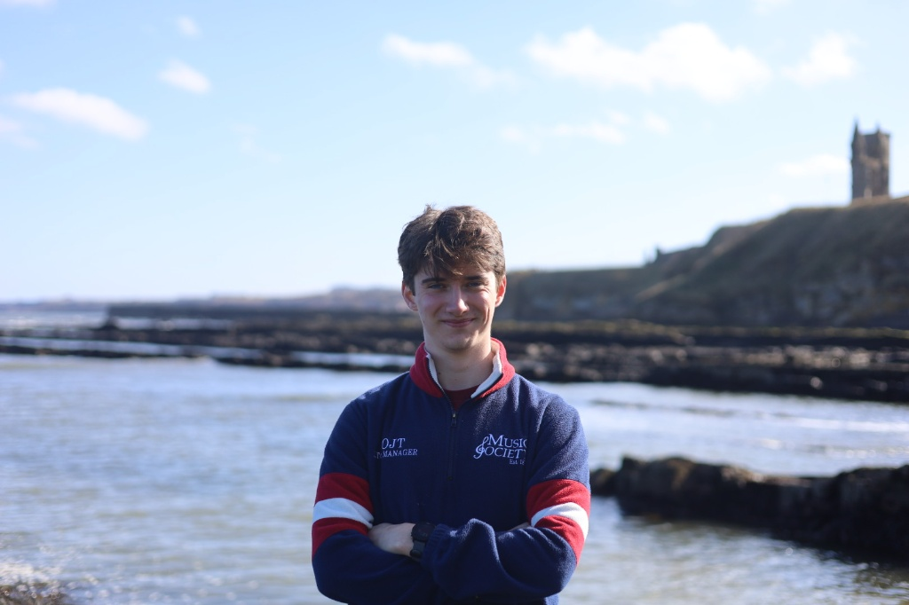

# Welcome!

I'm currently studying for an [MSc Artificial Intelligence](https://www.imperial.ac.uk/computing/prospective-students/courses/pg/mai/) at [Imperial College London](https://www.imperial.ac.uk/). Previously I studied Mathematics and Theoretical Physics at the [University of St Andrews](https://www.st-andrews.ac.uk/). I am interested in building safe and trustworthy AI systems that can solve meaningful problems.

[CV](/cv.pdf) · [LinkedIn](https://www.linkedin.com/in/owain-thorp-202a45242/) · [GitHub](https://github.com/ojlt) · &#91;first&#93;.&#91;last&#93; @ proton.me
